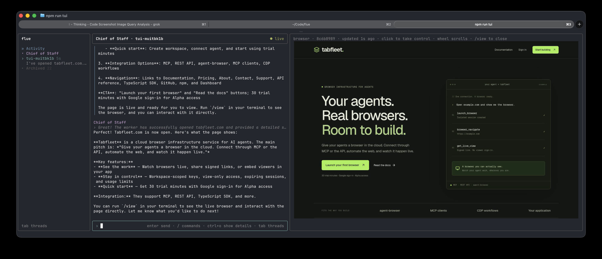

# flue-tui



A terminal UI for [Flue](https://flueframework.com) agents. You talk to a **Chief of Staff**; it
answers what it can and runs a team of **workers** for everything else: web research, operating
websites in a cloud browser you can watch and take over, and anything in between.

```
╭ flue ─────────────╮╭ Chief of Staff · tui-muishz5n ──────────────── ● live ╮╭ browser ─────────────╮
│ » Activity        ││ you                                                   ││                      │
│ ▾ Chief of Staff  ││ how much does tabfleet cost?                          ││   (live view of the  │
│ › tui-muishz5n    ││                                                       ││    worker's browser) │
│ ▾ Worker          ││ Chief of Staff                                        ││                      │
│   pricing researc…││ ⚙ spawn_worker({"role":"Pricing Researcher",…}) ✓     ││                      │
│ ▸ Archived 19     ││ ⧗ Pricing Researcher is working · 14s                 ││                      │
╰───────────────────╯╰───────────────────────────────────────────────────────╯╰──────────────────────╯
```

## How it works

- **Chief of Staff** (`src/agents/chief.ts`) is the agent you talk to. It answers simple questions
  itself, hands one-off analysis to a built-in subagent, and delegates everything else.
- **Workers** (`src/agents/worker.ts`) are spawned by the chief for a role ("pricing analyst"),
  each with its own conversation you can open and watch. Abilities: `search` (web search via
  Claude's server-side search and fetch) and `browser` (a [Tabfleet](https://tabfleet.com) cloud
  browser). The chief retires them when their work is done.
- Agents message each other asynchronously (`src/tools/agent-messaging.ts`). Replies are
  enforced: an agent that finishes a request without answering is sent back to deliver it.
- **MCP servers** are configured in `mcp.json` and picked up without a restart.
- **The TUI** (`tui/`) shows agents and threads in a sidebar, streams conversations, and renders a
  worker's browser in a side column (Kitty graphics in Ghostty/Kitty, colored blocks elsewhere).
  Click the page to take control; Esc hands it back.

## Setup

Requires Node.js 22.19 or later.

```bash
npm install
cp .env.example .env   # then add your ANTHROPIC_API_KEY (and TABFLEET_API_KEY for the browser)
npm run tui
```

`npm run tui` starts the Flue dev server in the background (logs: `/logs`) and stops it when you
quit. If you'd rather run the server yourself, use `npm run dev` in another terminal; the TUI will
connect to it.

## Using the TUI

| Key | |
|---|---|
| `Tab` | Switch between the sidebar and the chat |
| `Enter` | Send; in the sidebar, open a thread |
| `↑` `↓` / wheel, `PgUp` `PgDn`, `Home` `End` | Scroll the conversation |
| `Esc` | Stop the agent's current work, or hand back the browser |
| `Ctrl+O` | Show or hide reasoning and runtime details |
| Sidebar: `x` | Archive a thread (or hide/remove an agent), `p` pin, `←` `→` fold, `n` new thread |

Type `/` for commands. The main ones:

| Command | |
|---|---|
| `/new [agent]`, `/open [agent] <thread>` | Start or open a thread |
| `/view` | Show the browser for this conversation, including a worker's; click it to take control |
| `/activity` | Messages between agents, across all threads |
| `/archive`, `/pin`, `/section add <name>`, `/move <section>` | Organize the sidebar |
| `/mcp add <name> <url> [--auth ENV_VAR] [--agents a,b]` | Add an MCP server (also `remove`, `grant`, `revoke`, `list`) |
| `/agent create <name> [chat\|researcher\|browser] [instructions]` | Add a registered agent (also `remove`, `restore`) |
| `/info`, `/logs`, `/help`, `/quit` | |

## Project layout

```
src/agents/      chief.ts, worker.ts, registry.ts (mount name → agent)
src/tools/       agent messaging, team management, web search, browser guidance
src/mcp.ts       loads mcp.json
src/workers.ts   worker definitions (data/workers.db)
src/tui-index.ts sidebar index and activity routes for the TUI
tui/             the terminal UI (Ink)
scripts/agent.ts create/remove agents and manage MCP servers (npm run agent)
```

## Security notes

- **Don't expose the server publicly as-is.** Flue's agent routes have no authentication: anyone
  who can reach them can read and message any conversation. Add auth middleware in `src/app.ts`
  before deploying ([Flue routing guide](https://flueframework.com/docs/guide/routing/)).
- The TUI's index routes are only served by the dev server unless `FLUE_TUI_TOKEN` is set.
- Keys live in `.env` (git-ignored). `mcp.json` refers to them as `${VAR}`, never by value.
- Pages a browser worker reads become part of its conversation and could try to steer it.
  Workers can't change the project's code; adding and removing agents is a developer command.
- Conversations are stored in `data/` (git-ignored).

## License

MIT
